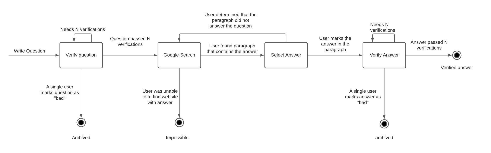
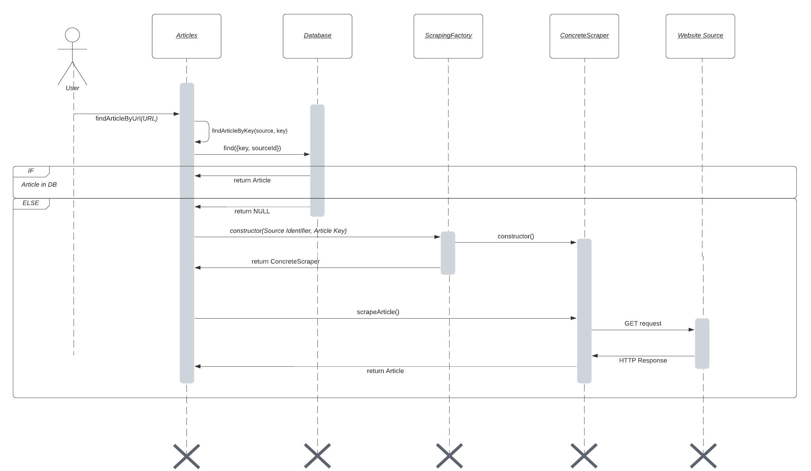
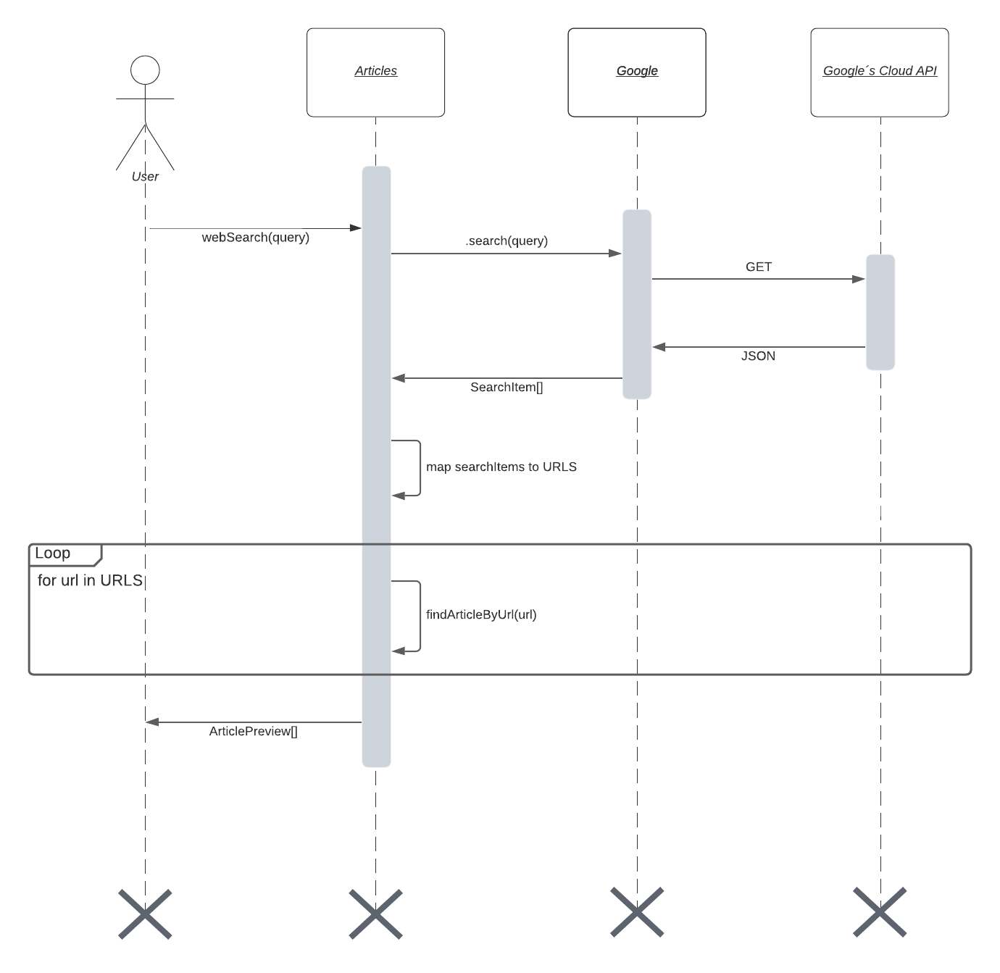
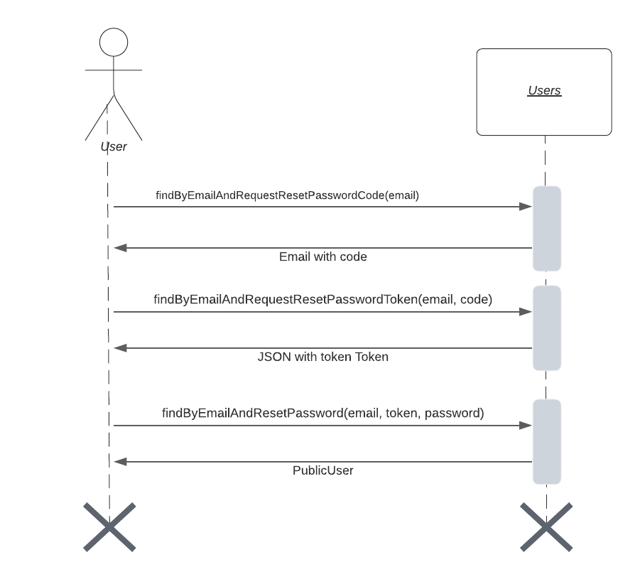

# Models

This module contains all Mongoose models which implement easy database access and provide us with validation, lifecycle (e.g. pre-save, pre-validate) hooks along with custom static function and instance methods.

In this readme you will see a brief documentation on each model as well as UML diagrams that explain the flow of data in what we call the `pipeline`.

Further documentation going into explanations of instance variables, methods, code implentation details and types can be found in the respective module folder.

## Why Mongoose

Initial requirement analysis suggested that a Document Oriented Database might be the way to go. As the project progressed and as the scope and idea increased and matured, it became clear that his was not necessarily the case. Due to the timeframe of the project, we decided to continue with the database in mind. We had little concern for the fact that a relational database might be more efficient, as the size of the dataset is not expected to grow in the millions, or billions of records per collection. Rather it was the fact that we might have benefitted from the relational model in the development of this project, for example key constraints.

MongoDB does, however, work exceptionally well in our case. And Mongoose's easy validation, lifecycle hooks, well documented interface and seamless TypeScript support has really had a positive impact on the speed of development.

## Models and the folder structure

The model folder structure is relatively simple. Each model is its own module, with an `index.ts` file which contains the model definition. Interfaces, static methods, instance methods, and utils are kept in their own file in order to maintain readability.

    .
    ├── Answers               # Answers model
    ├── Questions             # Questions model
    ├── Users                 # example of a Model folder
    │   │   ├── __test__      # test folder
    |   |   └── ...           # 0..N folders with local logic
    │   ├── index.ts          # index file with schema and model definition
    │   ├── interface.ts      # interfaces declared for TS support
    │   ├── methods.ts        # instance methods defined here
    │   ├── statics.ts        # model static functions defined here
    │   └── utils.ts          # utilities for the model
    ├── ...                   # ... other models
    └── README.md

### Users

The users model contains information about the users of our platform.

### Questions

The questions model contains information about user submitted questions and their state in the `pipeline`.

### Answers

The questions model contains information about user submitted answers and their state in the `pipeline`.

### Articles

Articles is a cache/store of articles that we have scraped online. Our policy is to not store the article unless there is a reference to one in other database models which depend on the article to remain unchanged. For example if we have an `Answers` instance which claims that there is an answer to a `Questions` instance in the Wikipedia page for Barack Obama in words 3-7 in paragraph 18, it is obvious that if the article changes in its source the `Answers` instance information becomes incorrect.

### Article Sources

An article source is a website that contains articles which we can scrape. An example would be Wikipedia. To see information on how to add new Article sources and how to add scrapers for a new article source see documentation [here](https://github.com/cadia-lvl/qa-crowdsourcing-api/blob/main/src/models/Articles/ScrapingService/readme.md).

### Game Rounds

A `GameRounds` instance keeps track of a users progress in their current level.

### Auth Tokens

An `AuthToken` instance is created for each user session. This was done so we could easily revoke sessions.

## The Pipeline

The pipeline describes the process user submitted content needs to go through in order to become a part of the dataset. The data enters the pipeline as a question, written by a user. The question goes through multiple steps that include question review, search for an answer, marking the answer, and verifying the answer. There is a lot of data generated during the pipeline and there are a few terminal states including 'completed' and 'archived'.

Below is a description of each step, accompanies with a state diagram that shows a high level overview of the process. There are many levels of abstractions we could have depicted, but we chose to show this high level overview as it will make code inspection and understanding the code easier. We also believe the well documented code can answer questions that might arise about lower level details and implementation.

### The diagram

The boxes show different intermediary states, black dots show terminal states and the arrows are labeled with actions that cause a state transition. In the description below will comment on both transitions and the states.

### Write question (transition / start)

When a user submits a question, the process starts for a new entity which is saved in our databse.

### Verify question (state)

A question that has been created and has not either been rejected (bad review) or reviewed positively N number of times is called unverified. A question in this state is presented to users until the question is either rejected or verified N times. A user can not review his own questions.

### Question is marked as bad (transition)

If a user mark the question as a 'bad question' it is archived. This transition results in the question landing on a terminal state.

### Question pased N verifications (transition)

A question that passes N verifications is considered verified and is placed to the Google Search stage.

### Google Search (state)

A question in this stage is presented to users as they are asked to find an article that contains the answer via Google. If successful, the user will mark the answer as a part of an article, otherwise the user can mark the question as impossible.

### User unable to find answer via Google (transition)

If the user says that he is unable to find an answer to the question online, then the question enters a terminal state and is marked as impossible.

### User finds a website that contains the answer (transition)

A user that finds the answer to a verified question via Google Search will mark the paragraph containing the answer and in the process of doing so will cause the side-effect of answer instance (referencing the question) to be created in the database.

### Select answer (state)

A newly created answer is still in the 'Select Answer' state, as even though an answer has been found it has not been marked / selected with in the paragraph. As the resource enters this stage only a paragraph on a website has been selected. But to advance from the 'Select Answer' stage a user must mark the exact words that contain the answer.

#### CAVEAT: yes / no questions

A question whose answer is either yes or no will not have their answer spans marked in the text. Rather, the answer will contain information on whether the answer is yes or no.

### User determinees that paragraph does **NOT** contain the answer (transition)

A user, tasked with selecting an answer within a paragraph can archive the answer if the paragraph does not contain the answer. In this case, we do not throw away everything up to this point, but rather reroute the resource to the Google Search phase hoping that another user will find the actual answer. The answer is marked as archived and the question is made available for the Google Search phase once more.

### User marks the answer in the paragraph (transition)

A user that marks the answer, after reviewing the paragraph, causes the question to transition from the Select Answer phase to the Verify Answer phase. At this point in time, the answer should be fully formed needing only verifications.

### Verify Answer (state)

A answer in this state should have all relevant fields set with only the verifications missing. Similar to the question verification state, an answer needs N positive reviews but a single negative one will result in the answer being archived.

### Single user gives an answer a negative review (transition)

A single negative review will cause the answer to be archived. This will result in a terminal state.

### N users verify the answer positively (transition)

When N users have given the answer a positive review, then the answer is considered 'verified' which results in a (positive) terminal state. This is the final transition of the pipeline.

## Open Article By URL

Articles can be opened via URL. This means, that if we have an article URL (which we might have gotten through Google Search) we can use that to retrieve an Article instance. This process -- as seen from the user -- which is typically initiated by the him by calling the API is transparent of whether we keep a cache of the article or not.

The reason for why some articles are cached or not is twofold:

1. There could potentially be millions of articles available to us and we really do not want to keep a backup of these sites, especially since our answers might only reference a thousand of them.

2. We need to store a copy of the article starting from the time the article is referenced (for example) by an answer. At that point in time, an answer is dependant on the contents of the article and if the article were to change, the answer metadata would be invalid. Thus, such content is sought from our cache instead of the world wide web.

Sites not in the cache are scraped in real time. We used a factory design pattern to allow easy scraping of multiple sites. The code documentation contains additional information about these processes. Further information about scraping and adding a new scraper can be found [here](https://github.com/cadia-lvl/qa-crowdsourcing-api/blob/main/src/models/Articles/ScrapingService/readme.md).

## Google Search

The google search query process is initiated by calling `.webSearch(query: string)` which is a static method on the Articles model, which returns an `ArticlePreview` array. The `webSearch` function calls our `Google` instance which encapsulates the functionality of calling Google's Cloud API. The Google's cloud api also simplifies the response and strips away the response meta data and returns only an array of `SearchItem` objects.

The `.webSearch` functions takes measures to make sure that all `ArticlePreview` object represent valid articles by scraping each URL (`ArticlePreview` objects contain the URL) and making sure that there is actual content present in the article. The reason for this is, due to the unpredictable nature of websites, we can not trust that every website/article contains data or is structured in a way that our scraper understands. This seemed to be a miniscule problem upfront but as it turns out, this affected more than 1% of all articles which is signifcant enough for us to do this check.

## Reset Password

The way the _reset password_ process is handled, from the users viewpoint, is through a code he receives via his (already) verified email address. The user is asked to insert an D digit long verification code, which is then sent to the back end. If the code is correct and valid, then a token is generated (by sha256 hash) which is then sent to the user via HTTP/JSON response. With this token, the front-end can ask the user to select a new password, which it can send to the backend with the token and the users email address to change the password. If the email address and token match, and if the token is valid then the password is reset.

